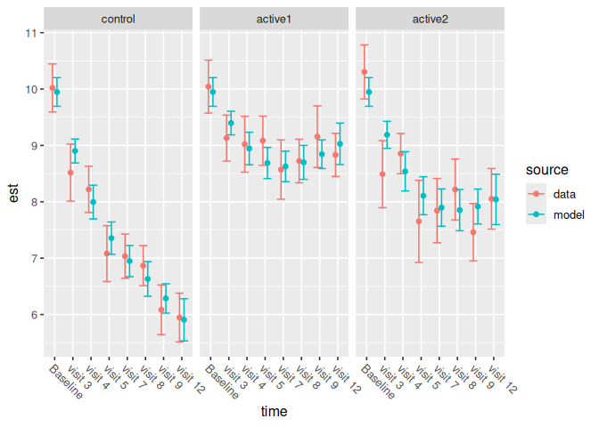
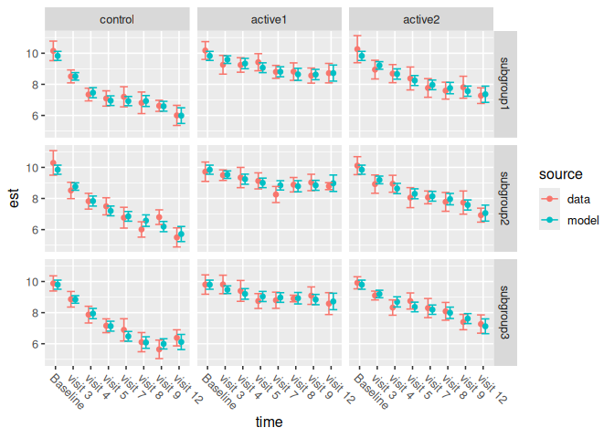

<!-- README.md is generated from README.Rmd. Please edit that file -->

# splinetrials

<!-- badges: start -->

[](https://app.codecov.io/gh/NikKrieger/splinetrials)
<!-- badges: end -->

The goal of splinetrials is to analyze longitudinal clinical data
applying natural cubic splines to a continuous time variable.

## Installation

You can install the development version of splinetrials from
[GitHub](https://github.com/NikKrieger/splinetrials) with:

``` r
# install.packages("pak")
pak::pak("NikKrieger/splinetrials")
```

# Methods

The NCS model is a longitudinal mixed model of repeated measures (MMRM)
with random effects marginalized out, additive baseline covariates, and
time parameterized using natural cubic splines. The parameterization has
additive effects and pairwise interactions for study arm and time point
(i.e., spline basis functions). The model is constrained so that all
study arms have equal means at baseline.

# Data

We begin with a clinical data set with one row per patient per scheduled
visit (including baseline). The following simulated data set represents
the general structure (e.g. column names) but not necessarily realistic
responses.

``` r
set.seed(1)
library(dplyr)
#> 
#> Attaching package: 'dplyr'
#> The following objects are masked from 'package:stats':
#> 
#>     filter, lag
#> The following objects are masked from 'package:base':
#> 
#>     intersect, setdiff, setequal, union
data <-
  mutate(
    cross_join(
      data.frame(
        patient = do.call(paste0, expand.grid(LETTERS, letters))[1:50],
        arm =
          sample(c("control", "active1", "active2"), 50, replace = TRUE),
        categorical1 = sample(paste0("level", 1:3), 50, replace = TRUE),
        categorical2 = sample(c("level1", "level2"), 50, replace = TRUE),
        continuous1 = rnorm(50),
        continuous2 = rnorm(50)
      ),
      data.frame(
        time_observed_index = seq_len(8),
        time_scheduled_index = seq_len(8),
        time_scheduled_label =
          c("Baseline", paste("visit", c(3, 4, 5, 7, 8, 9, 12))),
        time_scheduled_continuous = seq(from = 0, length.out = 8) / 4
      )
    ),
    time_observed_continuous =
      time_scheduled_continuous + runif(n(), min = -0.1, max = 0.1),
    response =
      rnorm(
        n(),
        10 - (1 * (arm == "active1") + 2 * (arm == "active2") +
                3 * (arm == "control")) * sqrt((time_observed_index / 4) -
                                                 min(time_observed_index / 4))
      )
  )

head(data)
#>   patient     arm categorical1 categorical2 continuous1 continuous2
#> 1      Aa control       level3       level2   0.6466744  -0.9106807
#> 2      Aa control       level3       level2   0.6466744  -0.9106807
#> 3      Aa control       level3       level2   0.6466744  -0.9106807
#> 4      Aa control       level3       level2   0.6466744  -0.9106807
#> 5      Aa control       level3       level2   0.6466744  -0.9106807
#> 6      Aa control       level3       level2   0.6466744  -0.9106807
#>   time_observed_index time_scheduled_index time_scheduled_label
#> 1                   1                    1             Baseline
#> 2                   2                    2              visit 3
#> 3                   3                    3              visit 4
#> 4                   4                    4              visit 5
#> 5                   5                    5              visit 7
#> 6                   6                    6              visit 8
#>   time_scheduled_continuous time_observed_continuous  response
#> 1                      0.00               0.07296151 10.685015
#> 2                      0.25               0.18543891 11.766415
#> 3                      0.50               0.49866375  8.439280
#> 4                      0.75               0.73594267  7.332906
#> 5                      1.00               1.01285277  6.027557
#> 6                      1.25               1.28123246  6.099311
```

The following is a summary of the required columns in the data set. Here
are the columns not related to time points or visits:

1.  `response`: User-supplied numeric vector of responses to the
    clinical endpoint. Could be `AVAL`.
2.  `patient`: User-supplied character vector, ID of the patient in the
    study. Usually `USUBJID`.
3.  `arm`: User-supplied character vector, study arm of the given
    patient.
4.  `categorical1`, `categorical2`: User-supplied example categorical
    baseline covariates.
5.  `continuous1`, `continuous2`: User-supplied example continuous
    baseline covariates.

Here are the columns related to time points or visits:

1.  `time_observed_continuous`: User-supplied numeric vector of
    continuous times corresponding to each observed patient visit.
    Varies from patient to patient. Units could be in years, months, or
    days, or some other unit. Must be on the same time scale as
    `time_scheduled_continuous`. (If the former is in weeks, then the
    latter must also be in weeks.)
2.  `time_observed_index`: User-supplied integer index vector of *bins*
    of observed time points. These numeric labels should indicate
    groupings of time points based on rounding
    `time_observed_continuous` to a small set of strategic fixed time
    points.
3.  `time_observed_factor`: Derived ordered factor version of
    `time_observed_index` to structure the correlation matrix. Derived
    as
    `ordered(as.character(time_observed_index), levels = as.character(sort(unique(time_observed_index))))`.
4.  `time_scheduled_index`: User-supplied integer index vector of
    scheduled visit numbers. Usually `AVISITN`.
5.  `time_scheduled_label`: User-supplied character vector of
    human-readable scheduled visit labels. Usually `AVISIT`.
6.  `time_scheduled_continuous`: User-supplied numeric vector of
    continuous times of when each visit was scheduled. It must be on the
    same time scale as `time_scheduled_continuous`, the values must have
    a one-to-one correspondence with the scheduled visits in
    `time_scheduled_label`, and the baseline must have a value of 0. If
    the time scale is weeks, then the study team can create this
    variable in advance using `time_scheduled_label` (e.g. `AVISIT`).
    For example, if `AVISIT` is `"Baseline"`, then
    `time_scheduled_continuous` must be 0. If `time_scheduled_label` is
    `"Visit Number 5 (Week 24)"`, then `time_scheduled_continuous`
    should be 24.

## Main analysis

The NCS analysis is a call to a single function: `ncs_analysis()`. This
produces a table of summary statistics, including LS means and
confidence intervals. All arguments to `ncs_analysis()` should be
exposed as user inputs.

``` r
library(splinetrials)
results_table <- ncs_analysis(
  data = data,
  response = "response",
  subject = "patient",
  arm = "arm",
  control_group = "control",
  time_observed_continuous = "time_observed_continuous",
  time_observed_index = "time_observed_index",
  time_scheduled_continuous = "time_scheduled_continuous",
  time_scheduled_label = "time_scheduled_label",
  covariates = ~ continuous1 + categorical2,
  cov_structs = c("us", "toeph", "ar1h", "csh", "cs"),
  df = 3
)
```

``` r
results_table
#> # A tibble: 24 × 32
#>    arm     time         n   est    sd    se lower upper response_est response_se
#>    <fct>   <chr>    <int> <dbl> <dbl> <dbl> <dbl> <dbl>        <dbl>       <dbl>
#>  1 active1 Baseline    19 10.0  1.04  0.240  9.57 10.5          9.95       0.127
#>  2 active1 visit 3     19  9.13 0.909 0.208  8.72  9.54         9.40       0.105
#>  3 active1 visit 4     19  9.02 1.10  0.253  8.53  9.52         8.94       0.144
#>  4 active1 visit 5     19  9.08 0.969 0.222  8.65  9.52         8.69       0.138
#>  5 active1 visit 7     19  8.57 1.17  0.268  8.05  9.10         8.63       0.134
#>  6 active1 visit 8     19  8.72 0.861 0.198  8.34  9.11         8.70       0.150
#>  7 active1 visit 9     19  9.16 1.21  0.278  8.61  9.70         8.84       0.126
#>  8 active1 visit 12    19  8.83 0.851 0.195  8.45  9.21         9.03       0.183
#>  9 active2 Baseline    13 10.3  0.883 0.245  9.82 10.8          9.95       0.127
#> 10 active2 visit 3     13  8.49 1.10  0.304  7.90  9.09         9.19       0.120
#> # ℹ 14 more rows
#> # ℹ 22 more variables: response_df <dbl>, response_lower <dbl>,
#> #   response_upper <dbl>, change_est <dbl>, change_se <dbl>, change_df <dbl>,
#> #   change_lower <dbl>, change_upper <dbl>, change_test_statistic <dbl>,
#> #   change_p_value <dbl>, diff_est <dbl>, diff_se <dbl>, diff_df <dbl>,
#> #   diff_lower <dbl>, diff_upper <dbl>, diff_test_statistic <dbl>,
#> #   diff_p_value <dbl>, percent_slowing_est <dbl>, …
```

The table has one row per study arm per timepoint of interest and the
following columns.

- `arm`: study arm, i.e. treatment group
- `time`: discrete visit time labels from the `time_scheduled_label`
  column in the data.
- `n`: number of non-missing observations.
- `est`: observed mean response in the data.
- `sd`: observed standard deviation of the response in the data.
- `se`: observed standard error of the response in the data (just
  `se / sqrt(n)`).
- `lower`: lower bound of an observed 95% confidence interval in the
  data.
- `upper`: upper bound of an observed 95% confidence interval in the
  data.
- `response_est`: LS mean of the response.
- `response_se`: standard error of the LS mean of the response.
- `response_df`: degrees of freedom of the LS mean of the response.
- `response_lower`: lower 95% confidence bound of the LS mean of the
  response.
- `response_upper`: upper 95% confidence bound of the LS mean of the
  response.
- `change_est`, `change_lower`, `change_upper`, `change_se`,
  `change_df`: like the analogous `response_*` columns, but for LS mean
  change from baseline.
- `change_test_statistic`: test statistic of a two-sided test that the
  LS mean change from baseline is not equal to 0, at a significance
  level of 5%.
- `change_p_value`: same as `change_test_statistic`, but the p-value
  instead of the test statistic.
- `diff_est`, `diff_se`, `diff_df`, `diff_lower`, `diff_upper`,
  `diff_test_statistic`, `diff_p_value`: same as the analogous
  `change_*` columns, but for treatment differences.
- `percent_slowing_est` LS mean of percent slowing (on the percentage
  scale).
- `percent_slowing_lower`, `percent_slowing_upper`: a conservative
  approximation to a confidence interval on percent slowing. Assumes
  uncorrelated changes from baseline.
- `correlation`: correlation structure of the whole model.
- `optimizer`: optimization algorithm for the whole model.

We can plot the model against the data.

``` r
ncs_plot_means(results_table)
```



## Subgroup analysis

The subgroup analysis is similar, but it begins with a data set with a
categorical variable column to indicate subgroup membership.

``` r
set.seed(1)
data_with_subgroup <-
  mutate(
    cross_join(
      data.frame(
        patient = do.call(paste0, expand.grid(LETTERS, letters))[1:120],
        arm = rep(c("control", "active1", "active2"), each = 40),
        subgroup = rep(c("subgroup1", "subgroup2", "subgroup3"), times = 40),
        categorical1 = sample(paste0("level", 1:3), 120, replace = TRUE),
        categorical2 = sample(c("level1", "level2"), 120, replace = TRUE),
        continuous1 = rnorm(120),
        continuous2 = rnorm(120)
      ),
      data.frame(
        time_observed_index = seq_len(8),
        time_scheduled_index = seq_len(8),
        time_scheduled_label =
          c("Baseline", paste("visit", c(3, 4, 5, 7, 8, 9, 12))),
        time_scheduled_continuous = as.numeric(seq(from = 0, length.out = 8) / 4)
      )
    ),
    time_observed_continuous =
      time_scheduled_continuous + runif(n(), min = -0.1, max = 0.1),
    response = rnorm(
      n(),
      mean =
        10 - (1 * (arm == "active1") + 2 * (arm == "active2") +
                3 * (arm == "control")) * sqrt((time_observed_index / 4) -
                                                 min(time_observed_index / 4))
    )
  )
```

``` r
head(data_with_subgroup)
#>   patient     arm  subgroup categorical1 categorical2 continuous1 continuous2
#> 1      Aa control subgroup1       level1       level1  -0.9568919   0.6060734
#> 2      Aa control subgroup1       level1       level1  -0.9568919   0.6060734
#> 3      Aa control subgroup1       level1       level1  -0.9568919   0.6060734
#> 4      Aa control subgroup1       level1       level1  -0.9568919   0.6060734
#> 5      Aa control subgroup1       level1       level1  -0.9568919   0.6060734
#> 6      Aa control subgroup1       level1       level1  -0.9568919   0.6060734
#>   time_observed_index time_scheduled_index time_scheduled_label
#> 1                   1                    1             Baseline
#> 2                   2                    2              visit 3
#> 3                   3                    3              visit 4
#> 4                   4                    4              visit 5
#> 5                   5                    5              visit 7
#> 6                   6                    6              visit 8
#>   time_scheduled_continuous time_observed_continuous response
#> 1                      0.00              -0.07428706 9.336270
#> 2                      0.25               0.23840196 9.916441
#> 3                      0.50               0.43845954 6.507177
#> 4                      0.75               0.73698012 7.510785
#> 5                      1.00               0.94502668 6.533178
#> 6                      1.25               1.34221926 9.607641
```

For completeness, here is a full description of the columns in the data.
Columns not related to time points or visits:

1.  `subgroup`: User-supplied character vector indicating the subgroup
    of each patient.
2.  `response`: User-supplied numeric vector of responses to the
    clinical endpoint. Could be `AVAL`.
3.  `patient`: User-supplied character vector, ID of the patient in the
    study. Usually `USUBJID`.
4.  `arm`: User-supplied character vector, study arm of the given
    patient.
5.  `categorical1`, `categorical2`: User-supplied example categorical
    baseline covariates.
6.  `continuous1`, `continuous2`: User-supplied example continuous
    baseline covariates.

Columns related to time points and visits:

1.  `time_observed_continuous`: User-supplied numeric vector of
    continuous times corresponding to each observed patient visit.
    Varies from patient to patient. Units could be in years, months, or
    days, or some other unit. Must be on the same time scale as
    `time_scheduled_continuous`. (If the former is in weeks, then the
    latter must also be in weeks.)
2.  `time_observed_index`: User-supplied integer index vector of *bins*
    of observed time points. These numeric labels should indicate
    groupings of time points based on rounding
    `time_observed_continuous` to a small set of strategic fixed time
    points.
3.  `time_observed_factor`: Derived ordered factor version of
    `time_observed_index` to structure the correlation matrix. Derived
    as
    `ordered(as.character(time_observed_index), levels = as.character(sort(unique(time_observed_index))))`.
4.  `time_scheduled_index`: User-supplied integer index vector of
    scheduled visit numbers. Usually `AVISITN`.
5.  `time_scheduled_label`: User-supplied character vector of
    human-readable scheduled visit labels. Usually `AVISIT`.
6.  `time_scheduled_continuous`: User-supplied numeric vector of
    continuous times of when each visit was scheduled. It must be on the
    same time scale as `time_scheduled_continuous`, the values must have
    a one-to-one correspondence with the scheduled visits in
    `time_scheduled_label`, and the baseline must have a value of 0. If
    the time scale is weeks, then the study team can create this
    variable in advance using `time_scheduled_label` (e.g. `AVISIT`).
    For example, if `AVISIT` is `"Baseline"`, then
    `time_scheduled_continuous` must be 0. If `time_scheduled_label` is
    `"Visit Number 5 (Week 24)"`, then `time_scheduled_continuous`
    should be 24.

The NCS subgroup analysis is a call to a single function:
`ncs_analysis_subgroup()`. This produces a table of summary statistics,
including LS means and confidence intervals.

``` r
subgroup_results <-
  ncs_analysis_subgroup(
    data = data_with_subgroup,
    response = "response",
    subject = "patient",
    arm = "arm",
    control_group = "control",
    subgroup = "subgroup",
    subgroup_comparator = "subgroup1",
    time_observed_continuous = "time_observed_continuous",
    time_observed_index = "time_observed_index",
    time_scheduled_continuous = "time_scheduled_continuous",
    time_scheduled_label = "time_scheduled_label",
    covariates = ~ continuous1 + categorical2,
    cov_structs = c("us", "toeph", "ar1h", "csh", "cs"),
    df = 3
  )
```

We can plot the model against the data.

``` r
ncs_plot_means_subgroup(subgroup_results$within)
```



Between-subgroup table:

``` r
subgroup_results$between
#> # A tibble: 72 × 30
#>    arm     time     subgroup      n   est    sd    se lower upper response_est
#>    <fct>   <chr>    <fct>     <int> <dbl> <dbl> <dbl> <dbl> <dbl>        <dbl>
#>  1 active1 Baseline subgroup1    13 10.2  1.05  0.292  9.60 10.7          9.83
#>  2 active1 Baseline subgroup2    14  9.72 1.19  0.317  9.10 10.3          9.85
#>  3 active1 Baseline subgroup3    13  9.81 1.14  0.317  9.18 10.4          9.80
#>  4 active2 Baseline subgroup1    13 10.3  1.60  0.444  9.39 11.1          9.83
#>  5 active2 Baseline subgroup2    13 10.1  1.06  0.295  9.53 10.7          9.85
#>  6 active2 Baseline subgroup3    14  9.92 0.741 0.198  9.53 10.3          9.80
#>  7 control Baseline subgroup1    14 10.2  1.20  0.320  9.52 10.8          9.83
#>  8 control Baseline subgroup2    13 10.3  1.45  0.402  9.50 11.1          9.85
#>  9 control Baseline subgroup3    13  9.88 0.896 0.249  9.39 10.4          9.80
#> 10 active1 visit 3  subgroup1    13  9.26 1.11  0.307  8.66  9.86         9.59
#> # ℹ 62 more rows
#> # ℹ 20 more variables: response_se <dbl>, response_df <dbl>,
#> #   response_lower <dbl>, response_upper <dbl>, change_est <dbl>,
#> #   change_se <dbl>, change_df <dbl>, change_lower <dbl>, change_upper <dbl>,
#> #   change_test_statistic <dbl>, change_p_value <dbl>, diff_subgroup_est <dbl>,
#> #   diff_subgroup_se <dbl>, diff_subgroup_df <dbl>, diff_subgroup_lower <dbl>,
#> #   diff_subgroup_upper <dbl>, diff_subgroup_test_statistic <dbl>, …
```

Within-subgroup table:

``` r
subgroup_results$within
#> # A tibble: 72 × 33
#>    arm     time     subgroup      n   est    sd    se lower upper response_est
#>    <fct>   <chr>    <fct>     <int> <dbl> <dbl> <dbl> <dbl> <dbl>        <dbl>
#>  1 active1 Baseline subgroup1    13 10.2  1.05  0.292  9.60 10.7          9.83
#>  2 active1 visit 3  subgroup1    13  9.26 1.11  0.307  8.66  9.86         9.59
#>  3 active1 visit 4  subgroup1    13  9.25 0.856 0.237  8.78  9.71         9.34
#>  4 active1 visit 5  subgroup1    13  9.42 1.01  0.280  8.87  9.97         9.07
#>  5 active1 visit 7  subgroup1    13  8.80 0.762 0.211  8.39  9.22         8.81
#>  6 active1 visit 8  subgroup1    13  8.82 1.03  0.286  8.26  9.38         8.64
#>  7 active1 visit 9  subgroup1    13  8.56 0.893 0.248  8.08  9.05         8.63
#>  8 active1 visit 12 subgroup1    13  8.72 1.15  0.319  8.09  9.34         8.72
#>  9 active2 Baseline subgroup1    13 10.3  1.60  0.444  9.39 11.1          9.83
#> 10 active2 visit 3  subgroup1    13  8.95 1.10  0.306  8.35  9.55         9.21
#> # ℹ 62 more rows
#> # ℹ 23 more variables: response_se <dbl>, response_df <dbl>,
#> #   response_lower <dbl>, response_upper <dbl>, change_est <dbl>,
#> #   change_se <dbl>, change_df <dbl>, change_lower <dbl>, change_upper <dbl>,
#> #   change_test_statistic <dbl>, change_p_value <dbl>, diff_arm_est <dbl>,
#> #   diff_arm_se <dbl>, diff_arm_df <dbl>, diff_arm_lower <dbl>,
#> #   diff_arm_upper <dbl>, diff_arm_test_statistic <dbl>, …
```

The between-subgroup and within-subgroup tables have one row per study
arm per timepoint per subgroup and the following columns.

- `arm`: study arm, i.e. treatment group
- `time`: discrete visit time labels from the `time_scheduled_label`
  column in the data.
- `subgroup`: subgroup level
- `n`: number of non-missing observations.
- `est`: observed mean response in the data.
- `sd`: observed standard deviation of the response in the data.
- `se`: observed standard error of the response in the data (just
  `se / sqrt(n)`).
- `lower`: lower bound of an observed 95% confidence interval in the
  data.
- `upper`: upper bound of an observed 95% confidence interval in the
  data.
- `response_est`: LS mean of the response.
- `response_se`: standard error of the LS mean of the response.
- `response_df`: degrees of freedom of the LS mean of the response.
- `response_lower`: lower 95% confidence bound of the LS mean of the
  response.
- `response_upper`: upper 95% confidence bound of the LS mean of the
  response.
- `change_est`, `change_lower`, `change_upper`, `change_se`,
  `change_df`: like the analogous `response_*` columns, but for LS mean
  change from baseline.
- `change_test_statistic`: test statistic of a two-sided test that the
  LS mean change from baseline is not equal to 0, at a significance
  level of 5%.
- `change_p_value`: same as `change_test_statistic`, but the p-value
  instead of the test statistic.
- `diff_arm_est`, `diff_arm_se`, `diff_arm_df`, `diff_arm_lower`,
  `diff_arm_upper`, `diff_arm_test_statistic`, `diff_arm_p_value`: same
  as the analogous `change_*` columns, but for treatment differences.
- `diff_subgroup_est`, `diff_subgroup_se`, `diff_subgroup_df`,
  `diff_subgroup_lower`, `diff_subgroup_upper`,
  `diff_subgroup_test_statistic`, `diff_subgroup_p_value`: same as the
  analogous `*_arm_*` columns, but for the subgroup differences.
- `percent_slowing_est` LS mean of percent slowing (on the percentage
  scale).
- `percent_slowing_lower`, `percent_slowing_upper`: a conservative
  approximation to a confidence interval on percent slowing. Assumes
  uncorrelated changes from baseline.
- `correlation`: correlation structure of the analysis subgroup model.
- `optimizer`: optimizer of the analysis subgroup model.

Type-III ANOVA fixed effects:

``` r
subgroup_results$type3
#> # A tibble: 15 × 6
#>    effect            chisquare_test_stati…¹    df  p_value correlation optimizer
#>    <chr>                              <dbl> <int>    <dbl> <chr>       <chr>    
#>  1 spline_fn(time_o…               134.         1 4.36e-31 heterogene… mmrm+tmb 
#>  2 spline_fn(time_o…               342.         1 2.23e-76 heterogene… mmrm+tmb 
#>  3 spline_fn(time_o…               189.         1 6.16e-43 heterogene… mmrm+tmb 
#>  4 subgroup                          0.0641     2 9.68e- 1 heterogene… mmrm+tmb 
#>  5 continuous1                       1.72       1 1.90e- 1 heterogene… mmrm+tmb 
#>  6 categorical2                      0.958      1 3.28e- 1 heterogene… mmrm+tmb 
#>  7 spline_fn(time_o…                 0.770      2 6.80e- 1 heterogene… mmrm+tmb 
#>  8 spline_fn(time_o…                 0.189      2 9.10e- 1 heterogene… mmrm+tmb 
#>  9 spline_fn(time_o…                 0.514      2 7.73e- 1 heterogene… mmrm+tmb 
#> 10 spline_fn(time_o…                24.7        2 4.26e- 6 heterogene… mmrm+tmb 
#> 11 spline_fn(time_o…               376.         2 2.02e-82 heterogene… mmrm+tmb 
#> 12 spline_fn(time_o…                42.0        2 7.62e-10 heterogene… mmrm+tmb 
#> 13 spline_fn(time_o…                13.9        4 7.74e- 3 heterogene… mmrm+tmb 
#> 14 spline_fn(time_o…                 2.62       4 6.23e- 1 heterogene… mmrm+tmb 
#> 15 spline_fn(time_o…                 2.54       4 6.37e- 1 heterogene… mmrm+tmb 
#> # ℹ abbreviated name: ¹​chisquare_test_statistic
```

There is also a table for the subgroup interaction test:

``` r
subgroup_results$interaction
#>           model      aic      bic    loglik -2*log(l) test_statistic df
#> 1 reduced model 2884.131 3040.231 -1386.066  2772.131             NA NA
#> 2    full model 2891.246 3080.796 -1377.623  2755.246       16.88529 12
#>     p_value                correlation optimizer
#> 1        NA heterogeneous unstructured  mmrm+tmb
#> 2 0.1539634 heterogeneous unstructured  mmrm+tmb
```

The test itself is a likelihood ratio test between a full model with
subgroup-treatment interaction and a reduced model without
subgroup-treatment interaction. The table has a row for the full model,
a row for the reduced model, and the following columns.

- `model`: the model, either full or reduced.
- `df`: degrees of freedom
- `aic`: Akaike Information Criterion
- `bic`: Bayesian Information Criterion
- `loglik`: log likelihood
- `test_statistic`: test statistic of the likelihood ratio test.
- `p_value`: p-value of the likelihood ratio test.
- `correlation`: correlation structures of the full and reduced models
  of the interaction test.
- `optimizer`: optimizers of the full and reduced models of the
  interaction test.
